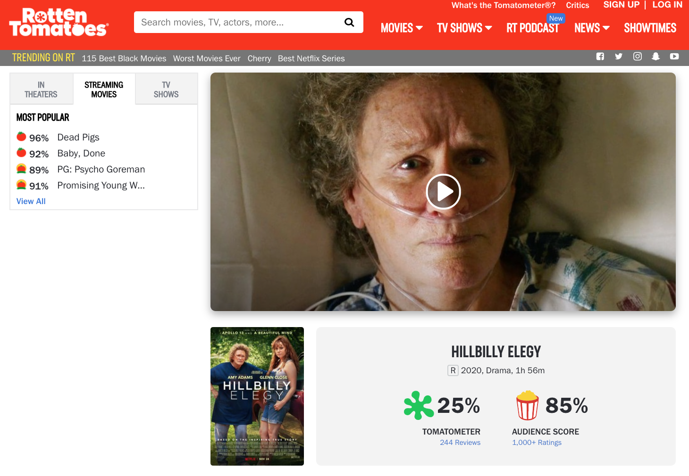
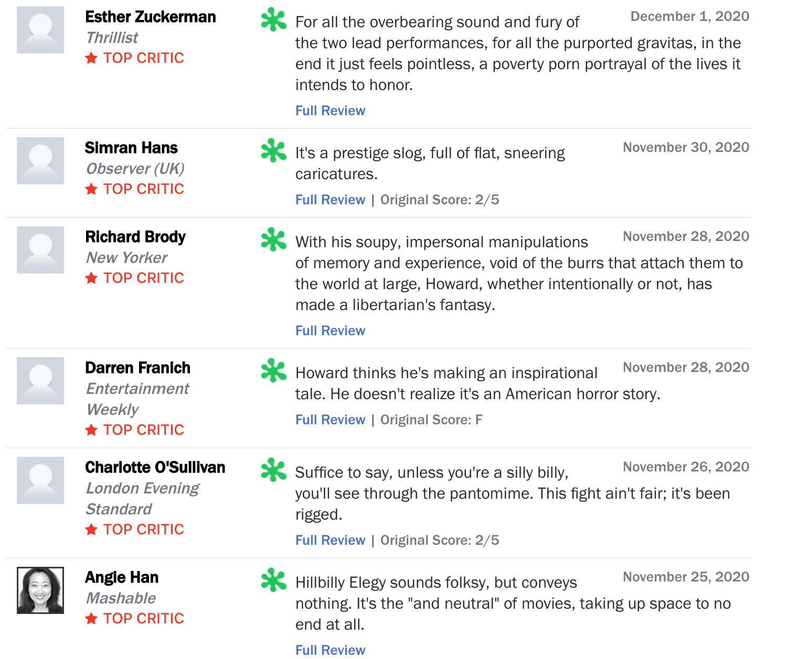

```{r setup, include=FALSE,message=F}
knitr::opts_chunk$set(echo = FALSE,warning=FALSE)
warn = getOption("warn")
options(warn=-1)
library(texreg)
```

# First post thoughts

Throughout the year, I come across interesting datasets that are ripe for story telling but that are without an obvious research dimension/question. This portion of the website is dedicated to sharing the first inklings that come to mind after sorting through and trying to glean a pattern (or two) from the data. 

# You say tomato, I say tomato?

[Hillbilly Elegy](https://www.harpercollins.com/products/hillbilly-elegy-j-d-vance?variant=32207704391714) is a highly readable, personal memoir detailing author [J.D. Vance](https://en.wikipedia.org/wiki/J._D._Vance)'s journey from/through a Appalachian (broken) community on to Yale Law School. The book was initially held in wide esteem, particularly among *The Atlantic* devotees, for providing a glimpse into the often inscrutable (to outsiders) class of voters who helped to elect Donald Trump. In response to the book's appeal and commercial success (*New York Times* Best Seller List 2016-2017), director [Ron Howard](https://www.rollingstone.com/movies/movie-news/ron-howard-to-direct-produce-hillbilly-elegy-movie-123741/) partnered with Netflix to adapt J.D.'s story for a full length motion picture. Given the source material, the choice of director, the talents of [Amy Adams](https://en.wikipedia.org/wiki/Amy_Adams) and [Glenn Close ](https://en.wikipedia.org/wiki/Glenn_Close), and a musical score by [Hans Zimmer](https://filmmusicreporter.com/2020/03/10/hans-zimmer-to-reteam-with-ron-howard-on-hillbilly-elegy/), the film appeared poised for future success. 

It was not to be. Well, defining <u>success</u> for which <u>kind</u> of audience is a matter of keen interest, and Rotten Tomatoes helps us get at measurement questions.  


[Rotten Tomatoes](https://www.rottentomatoes.com/) (RT hereafter) is review-aggregation website where users can rate and review both movies and television shows. RT reviewers fall into two camps: critics and (general) audience. "Critics" typically belong to: writing guilds, film critic associations, and/or major newspapers whereas "Audience" reviews come from any/all RT users with an RT account. 

RT's [reviews](https://www.rottentomatoes.com/m/hillbilly_elegy) of Hillbilly Elegy are decidedly polarized: critics panned the same film general audience members loved: 

In other words, general audience members on average rated Hillbilly Elegy about 60 percentage points higher than critics... quite a difference in opinion. Taking a cursory glance at Top Critic reviews suggests something a through line that unifies Top Critic feedback: an aversion to not only artistic sensibilities but to the film's political undertones: 



Seeing this discrepancy brought to mind both: (1) other RT titles where Critics and Audience members held strongly opposed views --- see [Star Wars: The Last Jedi](https://www.rottentomatoes.com/m/star_wars_the_last_jedi) where Critics rated the film at 90% to the Audience's 42% --- and (2) growing evidence of [media consumption differences](https://www.nytimes.com/interactive/2016/12/26/upshot/duck-dynasty-vs-modern-family-television-maps.html) as a part of larger political/cultural polarization trends. 

With all of this background in mind, I assembled a dataset to help answer the following questions: 

* Do Rotten Tomatoes Reviews evidence systematic film-taste differences between cultural elites (e.g. Critics Audience Reviews) and general audiences (e.g. Audience Reviews)? 
* Are taste differences growing over time? If so, in which direction? 
* What are the box office implications of producing films which divide Critics and Audience members? 


In later versions of the page, I will spell out the details of the dataset creation. At a high level, all I did was: first, web-scrape Wikipedia for all American films made annually between 1920-2020; second web-scrape Rotten Tomatoes for Critic/Audience scores; and, third, web-scrape [IMDb](https://www.imdb.com/?ref_=nv_home) for information about the film (e.g. box office gross world wide and in the US, operating budget, director, etc). Web scraping was performed using R's `rvest` library. All said and done, the final web-scraped/merged dataset has about a 8,900 movies across the past century (1920-2020) of American film.  

## Preliminary Results


```{r echo=FALSE, include=FALSE}
library(readr)
library(tidyverse)
library(ggplot2)
Movie_merge=read_csv("~/Desktop/Indiana/Year 4/Misc Data Projects/Movie_merge.csv")

g1=Movie_merge%>%
  mutate(AllCriticsScore=as.numeric(AllCriticsScore),
         AudienceScore=as.numeric(AudienceScore),
         dif=AllCriticsScore-AudienceScore,
         a_dif=abs(dif),
         genre2=substr(Genre,1,regexpr(",",Genre)-1)%>%toupper(),
         bin=cut(dif,breaks = seq(-100,100,by=10)))%>%
  filter(is.na(bin)==F)%>%
  group_by(bin)%>%
  tally()%>%
  ungroup()%>%
  mutate(share=n/sum(n))%>%
  ggplot(aes(x=bin,y=share))+
  geom_bar(stat="identity",color="black",aes(fill=share))+
  ggthemes::theme_clean()+
  theme(axis.text.x = element_text(angle = 90, vjust = 0.5, hjust=1))+
  labs(x="Critic Score-Audience Score Bin",y="Total share of movies",fill="Movie Share")


g3=Movie_merge%>%
  mutate(AllCriticsScore=as.numeric(AllCriticsScore),
         AudienceScore=as.numeric(AudienceScore),
         dif=AllCriticsScore-AudienceScore,
         a_dif=abs(dif),
         genre2=substr(Genre,1,regexpr(",",Genre)-1)%>%toupper(),
         bin=cut(dif,breaks = seq(-100,100,by=10)))%>%
  filter(is.na(bin)==F)%>%
  group_by(bin,genre2)%>%
  tally()%>%
  ungroup()%>%
  group_by(genre2)%>%
  mutate(share=n/sum(n))%>%
  ggplot(aes(x=bin,y=share))+
  geom_bar(stat="identity",color="black",aes(fill=share))+
    facet_wrap(~genre2)+
  ggthemes::theme_clean()+
  theme(axis.text.x = element_text(angle = 90, vjust = 0.5, hjust=1))+
  labs(x="Critic Score-Audience Score Bin",y="Total share of movies",fill="Movie Share")

g4=Movie_merge%>%
  mutate(AllCriticsScore=as.numeric(AllCriticsScore),
         AudienceScore=as.numeric(AudienceScore),
         dif=AllCriticsScore-AudienceScore)%>%
  group_by(Year)%>%
  filter(Year>1929)%>%
  summarise(std_var=var(dif,na.rm=T)/(n()))%>%
  ggplot(aes(x=Year,y=std_var))+
  geom_line()+
  scale_x_continuous(breaks = seq(1930,2020,10))+
  geom_smooth(method = "loess",se=F,span=0.25)+
  labs(x="Year",y="Std Variance")+
  ggthemes::theme_clean()


g5=Movie_merge%>%
  mutate(AllCriticsScore=as.numeric(AllCriticsScore),
         AudienceScore=as.numeric(AudienceScore),
         dif=AllCriticsScore-AudienceScore,
         a_dif=abs(dif))%>%
  group_by(Year)%>%
  summarise(var=mean(dif,na.rm=TRUE))%>%
  ggplot(aes(x=Year,y=var))+
  geom_bar(stat="identity")+
  labs(y="Expected Critic-Audience Score",title = "Rotten Tomatotes Critic/Audience Differences")+
  ggthemes::theme_clean()+
  stat_smooth(method = "loess",se=F,span=0.3,color="blue")+
  scale_y_continuous(breaks = seq(-20,40,10))+
  scale_x_continuous(breaks = seq(1920,2020,10))+
  geom_vline(xintercept = 1998,linetype="dashed",color="red")

```
Define *score discrepancy*, $s_i$, as the difference between the Critic and Audience RT score for film $i$. If $s_i<0\;  (s_i>0),$ this means that Audience (Critic) reviewers, on average, liked film $i$ more than Critic (Audience) Reviewers.   

The first chart depicts the distribution of $s_i$ across all years in the data. I compute the share of films with score discrepancies that fall within 10-percent increments (e.g. films were Critics scored a film between 0 and 10 percentage points higher than Audience members account for 22.6% of films).  Notice that the total number of films where $|s_i|\leq10\%$ is about 40% of all movies and that Audience reviewers tend to rate movies slightly higher (e.g. $s_i<0$ accounts for 52% of all films). 

```{r, echo=FALSE}
plotly::ggplotly(g1)
```

The second chart gives us our first look at time trends. I constructed this chart by computing the variance of $s_i(t),$ that is all films from year $t$, and then dividing said variance by the number of films that year thus "standardizing" the variance. Notice here that there is a downward trend/less score discrepancy variation up until about 2010. 

```{r, echo=FALSE, message=FALSE }
g4
```

The third chart plots the expected score difference for films in year $t$. Up until the mid-1980's, Critics tended to rate films higher than to Audience members. From the mid-1980's to the about 2015, Audience members tended to rate films higher relative to Critics. Two important caveats here: 

1. The dashed red line signifies the year (1998) that RT was launched as a website. Film scores before 1998 reflect *contemporary* audiences evaluating *historical* films whereas scores post 1998 reflect *contemporary* audiences evaluating *contemporary* films.

2. From about 2006 to 2018, the expected score difference went from roughly -17% to +5%. Put differently, expected film scores **swing about 20 percentage points in little more than a decade**. In historical context, the same kind of score jump took about three (3) decades to complete: expected score differences went from +5% in 1976 to -17% in 2006. 

```{r, echo=FALSE,message=FALSE }
plotly::ggplotly(g5)
```


```{r,echo=FALSE,include=FALSE}
inflation <- read_csv("~/Desktop/Indiana/Year 4/Misc Data Projects/inflation_data.csv")
inflation=inflation%>%mutate(USD2020=amount/amount[year==2020])%>%
  select(Year=year,USD2020)

Movie_merge$gross_usaf=as.numeric(Movie_merge$gross_usa)

Movie_merge=Movie_merge%>%inner_join(inflation)%>%
  mutate(gross_usa_r=(gross_usaf/USD2020)/10^6)

Movie_merge=Movie_merge%>%
  mutate(budget2=as.numeric(budget),
         budget_r=(budget2/USD2020)/10^6)

Movie_merge$aca_bindary=ifelse(Movie_merge$aca_nom=="No",0,1)

Movie_merge=Movie_merge%>%
  mutate(profit=gross_usa_r-budget_r,
         ROI=gross_usa_r/budget_r)

Movie_merge_s=Movie_merge%>%filter(Year>1997)

library(lfe)
mod1=felm(data=Movie_merge_s,gross_usa_r~budget_r+aca_nom+AllCriticsScore|Genre+Year)
mod2=felm(data=Movie_merge_s,gross_usa_r~budget_r+aca_nom+AudienceScore|Genre+Year)
mod3=felm(data=Movie_merge_s,gross_usa_r~budget_r+aca_nom+imdb_score+aca_nom|Genre+Year)
```

## Simple Regression Results 

This last section here attempts to tease out some kind of relationship between RT review scores and box office performance. In particular, I estimate the following model: 

$$G_{i,t}=\beta_0+\beta_1 Budget_{i,t}+ \beta_2 Academy_{i,t}+\beta_3 Rating_{i,t}+\theta_t+\gamma_i+\varepsilon_{i,t}$$
where the dependent variable is $G_{i,t}$ is the US box office real gross (mil 2020 USD) for film  $i$ made at time $t$, and independent variables include: $Budget_{i,t}$ is the film's real (mil 2020 USD) budget, $Academy_{i,t}$ is a dummy variable that codes for whether a film was nominated for an Academy Award, $\theta_t$ and $\gamma_i$ capture time and genre fixed effects, and $Rating_{i,t}$ is the variable of interest. In Model (1), I use Critics's review scores for $Rating_{i,t},$ whereas I use Audience review scores and (pooled) IMBd scores for $Rating_{i,t}$ in Model (2) and Model (3), respectively. 


```{r, echo=FALSE}
screenreg(list(mod1,mod2,mod3),digits = 3,stars = c(0.01,0.05,0.1))
```

Highlights from the preceding regression table include: 

* RT scores are positively correlated with real US box office grosses. 
* A one (1) point RT score increase from an Audience review is worth about 1.29 mil 2020 USD compared to 0.671 mil 2020 USD value for an analogous Critic score; thus, **Audience scores are worth about 620k USD more than Critic Scores** (in term of US box office gross). 
* Audience score models have slightly higher explanatory power relative to Critic score models.  
* The IMBd model serves as a nice robustness check for the RT models. Since IMBd scores range from 0-10 and RT scores range from 0-100, a quick conversion of units reveals that a one point increase in IMBd score is associated with a 1.98 mil increase in US box office gross. 