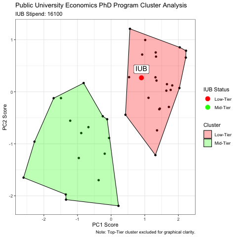

```{r setup, include=FALSE}
knitr::opts_chunk$set(echo = TRUE)
```

## One of these programs is not like the other?

How similar are economics PhD programs? Which program attribute, or set of attributes, is the most informative to compare one program against another. Common attributes range from difficulty of admission, to quality of initial job market placement, to even the amount and regularity of funding. While comparing two programs on the basis of a single characteristic, say probability of failing preliminary exams, is straightforward enough, any good analysis should reflect all possible program dimensions in a parsimonious way; in other words, we would like to employ a method that reduces the number of dimensions to consider while retaining essential information (e.g. data variation). Moreover, how do we come up with groupings/clusters after we've applied our dimension reduction technique? 


In this exercise, I collect the following data for U.S. public universities that award Economics PhDs:

* **Program Ratings**: Sourced from the [2017 US-News and World Report](https://www.usnews.com/best-graduate-schools/top-humanities-schools/economics-rankings)peer assessment score for Economics Ph.D. programs. Ratings range from 1 (marginal) to 5 (outstanding). The next release of US-News and World Report ranks is scheduled for 2023.
* **Stipends**: Sourced directly from program websites, such as [Virginia Tech](https://aaec.vt.edu/academics/graduate/funding.html), or from self-reported sources (*read*: current students). Self-reported data come from one of three sources: (i) [Economics Job Rumors](https://www.econjobrumors.com/); (ii) [The Grad Cafe](https://www.thegradcafe.com/survey/index.php?q=Economics&o=); and/or (iii) [PhD Stipends](http://www.phdstipends.com/). I use the most recent year of data across all stipend sources. Particular program stipend estimates and sourcing details are available upon request. 
* **Cost of Living (COL)**: Mapped each program to its respective U.S. city and then matched [Sperling's](https://www.bestplaces.net/) 2020 estimated cost of living index to program location.
* **Application Volume**: Sourced from one of three sources: (i) program  websites, such as [UC Berkeley](https://www.econ.berkeley.edu/grad/admissions/faq#numbapps); (ii) university system wide admissions data, such as [UT-Austin](https://gradschool.utexas.edu/admissions/where-to-begin/admissions-and-enrollment-statistics); and, (iii) [Peterson's Grad School Search Engine](https://www.petersons.com/search/grad?q=Economics). 


Armed with these data
$$X_i=\{\text{Ratings}_i,\text{Stipend}_i,\text{COL}_i,\text{Applications}_i\}$$

for programs $i=1,\dots, 50$, I: first use [Principal Component Analysis](https://royalsocietypublishing.org/doi/10.1098/rsta.2015.0202) (PCA hereafter) to reduce the 4D data space (e.g. four predictors) into a 2D PCA-coordinate grid; then, second use [K-means Cluster Analysis](https://uc-r.github.io/kmeans_clustering#gap) to optimally group PhD programs. After estimating a so called [Gap Statistic](http://web.stanford.edu/~hastie/Papers/gap.pdf), I find that the optimal number of clusters is three, i.e. $K=3.$ These 3 clusters roughly correspond to program ranking and prestige; denote Cluster 1 as  *Top-Tier* programs (e.g. UC Berkeley is in this cluster), Cluster 2 as *Mid-Tier* programs (e.g. the University of Pittsburgh is in this cluster), and Cluster 3 as  *Low-Tier* programs (e.g. University of Wyoming is in this cluster). 


## Indiana University Bloomingtion (IUB): A Low-Tier Program

IUB is ranked within the top-third of all public university economics PhDs on the basis of its rating (e.g. 3.2). However, as of 2020, IUB's stipend  of 16,100 (USD) placed it in the **bottom 87%** of all public programs. Even with a cost of living adjustment, IUB's stipend still falls within the **lower half** of all public programs. In a related fashion, IUB's latest application volume of roughly 135 applicants also placed it within the **lower half** of all public programs. 


All of this to say, notwithstanding IUB's respectable program rating, a meager stipend and middling application volume help to land IUB squarely within the  *Low-Tier* program-cluster. Notice that IUB and Iowa are the only Big10 programs located in the  *Low-Tier* program cluster (all Big10 programs are labeled). Belonging to the *Low-Tier* program-cluster means that IUB has more in common (on the basis of this analysis) with the University of Alabama (rating 2.0) than it is to Purdue (rating 3.1 and Purdue is the *Mid-Tier* program-cluster. 


## What will it take for IUB to join the Big10 (cluster)?

As something of a thought-experiment, I increase IUB's 16,100 (USD) stipend by increments of 100 (USD) until IUB is identified by the K-means clustering analysis as a *Mid-Tier* program. Note that each new/synthetic IUB stipend requires re-running/re-calculating PCA scores. 

It turns out that if IUB's stipend were 19,800 (USD), then IUB finally joins the ranks of other Big10 *Mid-Tier* programs. To illustrate, consider the animation below which displays the relationship between IUB's increased stipend and PCA scores and clustering status:  




